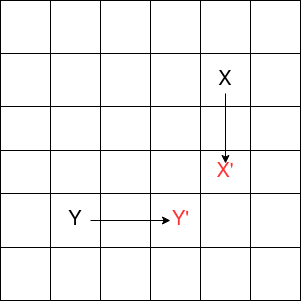
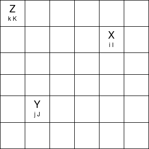
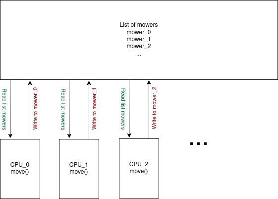

# mower

## Requirements

Java 11 runtime environment.
Maven 3.6.3

## Usage

    mvn clean install
    mvn exec:java -Dexec.mainClass="org.example.mower.Application"

## Goal
Build a program that implements the following mower specification.
## Specification
The client, company X, wants to develop an algorithm to mow rectangular surfaces.
Mowers can be programmed to move throughout the entire surface. A mower's position is
represented by Cartesian coordinates (X, Y), and an orientation (N, E, W, S). The lawn is
divided into a grid to simplify navigation.

For example, the position 0,0,N indicates the mower is in the lower left corner of the lawn facing
north.

To move the mower, we use a series of a combination of the following commands: L, R, and F.
L and R turn the mower 90° left or right without moving the mower. F means move forward one
space in the direction the mower is currently facing without changing its orientation.
If a forward movement would cause the mower to move outside of the lawn, the mower remains
in the position and this command is discarded. The position directly to the north of (X, Y) is (X, Y
+ 1) and the position to the east of (X, Y) is (X + 1, Y).

Different mowers may not occupy the same space at the same time, and if a mower receives a
move forward instruction that would cause it to run into another mower, the move forward
instruction is silently discarded.

Your simulation will be run on a machine with multiple CPUs so multiple mowers should be
processed simultaneously in order to speed up the overall execution time.
The mowers are programmed using an input file constructed in the following manner:
The first line corresponds to the upper right corner of the lawn. The bottom left corner is
implicitly (0, 0).

The rest of the file describes the multiple mowers that are on the lawn. Each mower is described
on two lines:

The first line contains the mower's starting position and orientation in the format "X Y O". X and
Y are the coordinates and O is the orientation.

The second line contains the instructions for the mower to navigate the lawn. The instructions
are not separated by spaces.

At the end of the simulation, the final position and orientation of each mower is output in the
order that the mower appeared in the input.

When designing and implementing your solution ensure that you keep in mind separation of
concerns, performance, and testing.

## Example
Input file

5 5

1 2 N

LFLFLFLFF

3 3 E

FFRFFRFRRF

Result

1 3 N

5 1 E

# Resolution

## Problem analyse
For a given size lawn(matrix), there are mowers(points) moving with commands. 
To have a determined result, we consider for each time unit, every lawn does one move,
and for each operation of same time unit, we move first mower x then mower y
where x, y are indices of mowers with x<y.

A simple algorithm with one CPU would be to operation one by one the lawn for each time unit.
To process with multiples CPUs, we can consider each CPU moves one lawn. A CPU can only do Nth move 
when CPUs with the index less have all finished their N th move and shared their position. However, by this way,
the performance is impacted.

Actually, one CPU can do more when waiting for others. Consider in the picture 1. The mower Y can surely go 2 steps 
as it is certain X will not get in its Path in 2 steps. 

## Algorithm

The algorithm is 
1.  Initiate each CPU(thread) with a mower, and the position map of other mowers at step 0
2.  For each CPU, move the mower as far as it can and update the  position map with its mower's current position and steps done.
3.  For each CPU, get the updated map of mowers, iterate on 2 until the moves done
4.  Once all CPU finished work, return final position of mowers. 

To calculate the steps a mower can move given a position map, please consider the follow picture_2:

X:  Mower with index X < index Y

i:  Steps done for X

I:  All steps for X

Y:  The mower to consider

j:  Steps done for Y

J:  All steps for Y

Z:  Mower with index X > index Y
k:  Steps done for Z
K:  All steps for Z

D:  Blank case between two mower. e.g: between X and Y is 5

To consider max steps to go for, find the Min in steps to go with X and Y. 

With X:

    i=I     steps=D
    i<I     i>j     I-i> = (D-(i-j))/2          steps=i-j +(D-(i-j))/2
                    I-i  < (D-(i-j))/2          steps=D-(I-i)
            i<j     I-i> = j-i+(D-(j-i))/2      steps=(D-(j-i))/2 
                    I-i  < j-i+(D-(j-i))/2      steps=D-(I-i)        
            i=j     I-i> = D/2                  steps=D/2     
                    I-i  < D/2                  steps=D-(I-i)
                                

With Z:

    k=K     steps=D                                                         
    k<K     j=k   D=0                           steps=1
                  D!=0
                    K-k >= D/2                  steps=D/2 +1      
                    K-k  < D/2                  steps=D-(K-k)+1              
            j<k     K-k >= (D-(k-j))/2          steps=k-j+(D-(k-j))/2+1           
                    K-k  < (D-(k-j))/2          steps=D-(K-k)+1               
            i>j     K-k >= j-k+(D-(j-k))/2      steps=j-k+(D-(j-K))/2+1                  
                    K-k  < j-k+(D-(j-k))/2      steps=D-(K-k)+1               

Once simplified:

With X:                                                                   
                                                                                                                               
    I-i> = (D-(i-j))/2          steps=(D+(i-j))/2
    I-i  < (D-(i-j))/2          steps=D-I+i

With Z:

    K-k >= (D-(k-j))/2          steps=(D+(k-j))/2+1  
    K-k  < (D-(k-j))/2          steps=D-K+k+1

## Implementation

To implement the solution, we need:

reader: reader from files, get lawn size and mowers' positon

worker: for each cpu, get current lawn map, move mower and update lawn map

mower:   store mower information

application: orchestrator, start "reader", "worker", output result

### Architecture:

